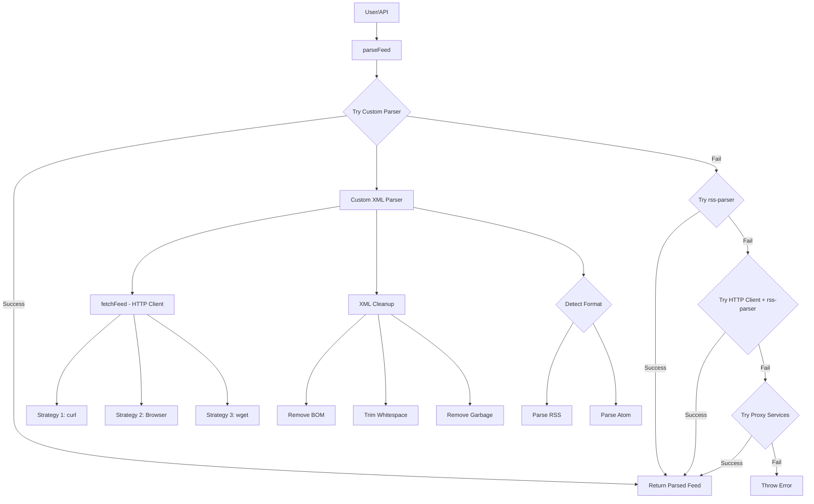
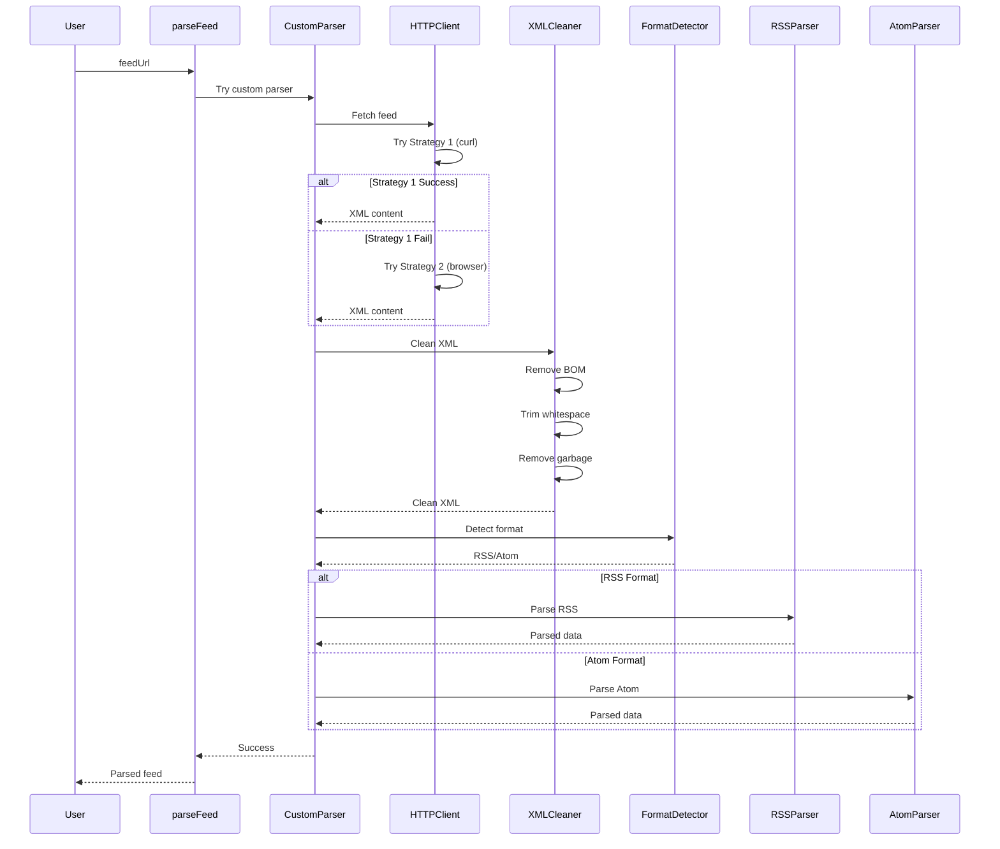
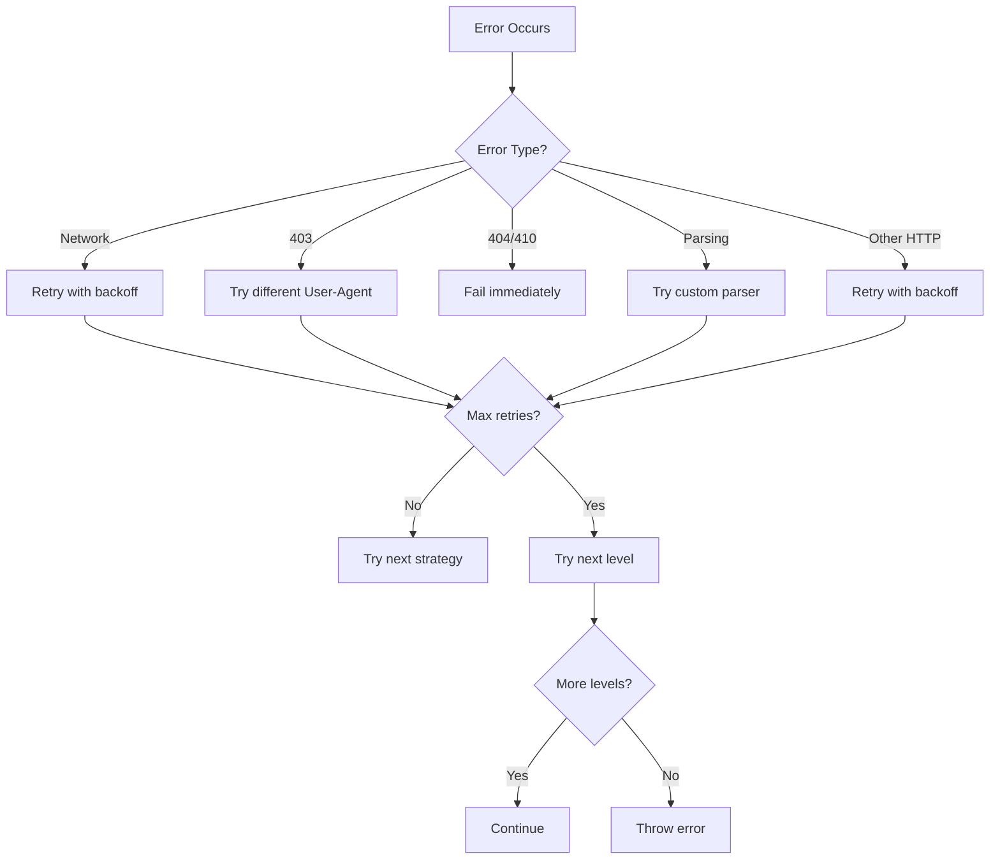

# Design Document: Robust Feed System

## Overview

This design implements a comprehensive feed parsing and discovery system that can handle all RSS/Atom feeds, including those with malformed XML, anti-bot protection, and non-standard formats. The system uses a layered approach with custom XML parsing, multiple HTTP fetching strategies, and intelligent fallback mechanisms.

### Key Design Principles

1. **Custom-First, Fallback-Second**: Try custom robust parser before falling back to rss-parser
2. **Multiple Strategies**: Use multiple HTTP fetching strategies and proxy services
3. **Aggressive Cleanup**: Clean XML content before parsing (BOM, whitespace, garbage)
4. **Detailed Logging**: Log every step for debugging and monitoring
5. **Backward Compatibility**: Maintain existing function signatures and data structures

### Problem Analysis

The current implementation has a critical flaw: **the custom parser V2 code exists but is never called**. The logs show:

```
[RSS Parser] Parsing feed (attempt 1/4): https://myduckisdead.org/feed
[RSS Parser] ✗ Failed to parse feed ... Error: Non-whitespace before first tag.
```

This error comes from `sax/xml2js` (used by rss-parser), which means the code is still using the old parser. The feed-parser-v2.ts files were created in the previous session but:
1. They don't exist in the codebase (file not found error)
2. Even if they did, they're imported but never actually called
3. The parseFeed function tries to call parseFeedV2 but it's wrapped in try-catch that silently fails

## Architecture

### Component Diagram



### Data Flow



## Components and Interfaces

### 1. Custom XML Parser (feed-parser-v2.ts)

**Purpose**: Parse RSS/Atom feeds using regex-based XML extraction, bypassing xml2js/sax limitations.

**Key Functions**:

```typescript
// Main entry point
export async function parseFeedV2(feedUrl: string): Promise<ParsedFeedV2>

// XML text extraction
function extractText(xmlString: string, tagName: string): string | undefined

// XML attribute extraction
function extractAttribute(xmlString: string, tagName: string, attribute: string): string | undefined

// RSS-specific parser
function parseRSS(xmlContent: string): ParsedFeedV2

// Atom-specific parser
function parseAtom(xmlContent: string): ParsedFeedV2

// Format detection
function detectAndParse(xmlContent: string): ParsedFeedV2
```

**Data Structures**:

```typescript
export interface ParsedFeedV2 {
  title: string;
  link?: string;
  description?: string;
  items: FeedItemV2[];
}

export interface FeedItemV2 {
  title: string;
  link: string;
  description?: string;
  content?: string;
  pubDate?: string;
  author?: string;
  guid?: string;
}
```

**XML Cleanup Strategy**:

1. Remove BOM (Byte Order Mark) - `\uFEFF` character
2. Trim leading/trailing whitespace
3. Find XML start (`<?xml`, `<rss`, or `<feed`) and remove everything before it
4. Log first 200 characters for debugging

**Parsing Strategy**:

- Use regex patterns to extract XML content
- Handle CDATA sections: `<![CDATA[...]]>`
- Extract both text content and attributes
- Support namespaced tags (e.g., `content:encoded`, `dc:creator`)

**RSS Parsing**:
- Extract feed-level: `<title>`, `<link>`, `<description>`
- Extract items: `<item>...</item>` blocks
- For each item extract: title, link, description, content, pubDate, author, guid

**Atom Parsing**:
- Extract feed-level: `<title>`, `<link href="...">`, `<subtitle>`
- Extract entries: `<entry>...</entry>` blocks
- For each entry extract: title, link (from href attribute), summary, content, published/updated, author, id

### 2. HTTP Client (http-client.ts)

**Purpose**: Fetch feed content using multiple strategies to bypass blocking.

**Key Functions**:

```typescript
// Main entry point with multiple strategies
export async function fetchFeed(url: string): Promise<string>

// Single strategy with retry logic
export async function fetchWithRetry(
  url: string,
  options: FetchOptions
): Promise<string>
```

**Fetching Strategies** (tried in order):

1. **Strategy 1: curl-like**
   - User-Agent: `curl/7.68.0`
   - Accept: `*/*`
   - Minimal headers
   - 2 retries with exponential backoff

2. **Strategy 2: Browser-like**
   - User-Agent: Chrome browser string
   - Accept: Full HTML/XML accept header
   - Accept-Language, Accept-Encoding, Connection headers
   - Upgrade-Insecure-Requests header

3. **Strategy 3: wget-like**
   - User-Agent: `Wget/1.20.3`
   - Minimal headers

**Error Handling**:
- Don't retry on 404/410 (permanent failures)
- Exponential backoff: 2s, 4s, 8s
- Timeout: 15 seconds per attempt
- Log each attempt and failure reason

### 3. RSS Parser Integration (rss-parser.ts)

**Purpose**: Main entry point that coordinates custom parser and fallback strategies.

**Current Implementation Issues**:
1. ❌ parseFeedV2 is imported but wrapped in try-catch that silently fails
2. ❌ No logging when custom parser fails
3. ❌ Falls back to rss-parser immediately, which hits the same xml2js error
4. ❌ The custom parser is never actually reached

**Fixed Implementation Flow**:

```typescript
export async function parseFeed(feedUrl: string, customUserAgent?: string): Promise<ParsedFeed> {
  console.log(`[RSS Parser] Starting parseFeed for: ${feedUrl}`);
  
  // STEP 1: Try custom robust parser (PRIMARY METHOD)
  try {
    console.log(`[RSS Parser] STEP 1: Trying custom parser V2...`);
    const result = await parseFeedV2(feedUrl);
    console.log(`[RSS Parser] ✓ Custom parser V2 succeeded`);
    
    // Convert to expected format
    return convertV2ToLegacyFormat(result);
  } catch (error) {
    console.error(`[RSS Parser] ✗ Custom parser V2 failed:`, error);
    // Continue to fallback
  }
  
  // STEP 2: Try rss-parser with multiple User-Agents
  // ... existing code ...
  
  // STEP 3: Try advanced HTTP client + rss-parser
  // ... existing code ...
  
  // STEP 4: Try proxy services
  // ... existing code ...
}
```

**Key Changes**:
- Custom parser is tried FIRST, not as fallback
- Detailed logging at each step
- Errors are logged but don't stop the flow
- Each step is clearly numbered in logs

### 4. Feed Discovery (feed-discovery.ts)

**Purpose**: Automatically discover feed URLs from website URLs.

**Discovery Levels**:

1. **Level 1: Direct Validation**
   - Try to parse the URL directly as a feed
   - If successful, return immediately
   - Fastest method for direct feed URLs

2. **Level 2: HTML Discovery**
   - Fetch the HTML page
   - Search for `<link rel="alternate">` tags
   - Support multiple patterns:
     - `<link rel="alternate" type="application/rss+xml" href="...">`
     - `<link rel="alternate" type="application/atom+xml" href="...">`
     - Reversed attribute order
     - Type-first patterns
   - Validate each discovered URL

3. **Level 3: Common Paths**
   - Try standard feed URLs:
     - `/feed`, `/feed.xml`, `/rss`, `/rss.xml`, `/atom.xml`
     - `/feed/rss`, `/feed/atom`, `/feeds/all`
     - `/blog/feed`, `/posts/feed`, `/news/feed`
     - WordPress: `/feed/rss/`, `/feed/rss2/`, `/feed/atom/`
   - Validate in parallel for speed

**Special Handlers**:

- **Reddit**: Convert `/r/subreddit` to `/r/subreddit.rss`
- **YouTube**: Extract channel ID and create feed URL
- **GitHub**: Convert user/repo URLs to `.atom` feeds

**Validation**:
- Use `validateFeedDirect()` to check if URL is valid feed
- Cache validation results (5 minute TTL)
- Return feed metadata (title, item count, last item date)

## Data Models

### Internal Format (Custom Parser)

```typescript
interface ParsedFeedV2 {
  title: string;
  link?: string;
  description?: string;
  items: FeedItemV2[];
}

interface FeedItemV2 {
  title: string;
  link: string;
  description?: string;
  content?: string;
  pubDate?: string;
  author?: string;
  guid?: string;
}
```

### Legacy Format (Existing System)

```typescript
interface ParsedFeed {
  title: string;
  link?: string;
  items: FeedItem[];
}

interface FeedItem {
  title: string;
  link: string;
  contentSnippet?: string;
  content?: string;
  contentEncoded?: string;
  isoDate?: string;
  pubDate?: string;
  creator?: string;
  author?: string;
  "dc:creator"?: string;
  mediaContent?: any;
  mediaThumbnail?: any;
  guid?: string;
  id?: string;
}
```

### Conversion Function

```typescript
function convertV2ToLegacyFormat(v2: ParsedFeedV2): ParsedFeed {
  return {
    title: v2.title,
    link: v2.link,
    items: v2.items.map(item => ({
      title: item.title,
      link: item.link,
      contentSnippet: item.description,
      content: item.content,
      contentEncoded: item.content,
      isoDate: item.pubDate,
      pubDate: item.pubDate,
      creator: item.author,
      author: item.author,
      "dc:creator": item.author,
      guid: item.guid,
      id: item.guid,
      mediaContent: undefined,
      mediaThumbnail: undefined,
    })),
  };
}
```

## Error Handling

### Error Categories

1. **Network Errors**
   - ETIMEDOUT: Timeout
   - ENOTFOUND: DNS resolution failed
   - ECONNREFUSED: Connection refused
   - ECONNRESET: Connection reset
   - CERT_HAS_EXPIRED: SSL certificate error

2. **HTTP Errors**
   - 403: Forbidden (try different User-Agent)
   - 404: Not found (don't retry)
   - 429: Rate limited (retry with delay)
   - 500+: Server error (retry)

3. **Parsing Errors**
   - "Non-whitespace before first tag": XML cleanup needed
   - "Invalid XML": Try custom parser
   - "No items found": Valid feed but empty

### Error Handling Strategy



### Logging Strategy

**Log Levels**:
- `console.log`: Normal operations, success messages
- `console.warn`: Recoverable errors, fallback attempts
- `console.error`: Fatal errors, final failures

**Log Format**:
```
[Component] Message
[Component] ✓ Success message
[Component] ✗ Error message
[Component] → Action being taken
```

**Examples**:
```
[Feed Parser V2] ===== PARSING FEED: https://example.com/feed =====
[HTTP Client] Strategy 1: Direct fetch with curl headers
[HTTP Client] ✓ Success (12345 bytes)
[Feed Parser V2] Clean XML first 200 chars: <?xml version="1.0"...
[Feed Parser V2] Parsing as RSS
[Feed Parser V2] RSS parsed: Example Feed (10 items)
[Feed Parser V2] ✓ Successfully parsed: Example Feed (10 items)
```

## Testing Strategy

### Unit Tests

1. **XML Cleanup Tests**
   - Test BOM removal
   - Test whitespace trimming
   - Test garbage removal
   - Test XML start detection

2. **Parsing Tests**
   - Test RSS parsing with various formats
   - Test Atom parsing with various formats
   - Test CDATA handling
   - Test namespaced tags
   - Test malformed XML handling

3. **HTTP Client Tests**
   - Test each strategy independently
   - Test retry logic
   - Test timeout handling
   - Test error handling

### Integration Tests

1. **End-to-End Feed Parsing**
   - Test with real feeds (myduckisdead.org, etc.)
   - Test with blocked feeds
   - Test with malformed feeds
   - Test with empty feeds

2. **Feed Discovery**
   - Test with various website types
   - Test special handlers (Reddit, YouTube, GitHub)
   - Test HTML discovery
   - Test common path discovery

### Test Feeds

```typescript
const TEST_FEEDS = {
  // Standard RSS
  standard_rss: "https://example.com/feed",
  
  // Malformed XML (BOM, whitespace)
  malformed: "https://myduckisdead.org/feed",
  
  // Blocked feeds
  blocked: "https://some-blocked-site.com/feed",
  
  // Atom feeds
  atom: "https://github.com/user/repo/releases.atom",
  
  // Empty feeds
  empty: "https://example.com/empty-feed",
};
```

## Performance Considerations

### Optimization Strategies

1. **Parallel Validation**
   - Validate multiple feed URLs in parallel
   - Use `Promise.all()` for common path discovery
   - Limit concurrent requests to avoid overwhelming servers

2. **Caching**
   - Cache feed validation results (5 minute TTL)
   - Cache successful parse results
   - Clean cache periodically to prevent memory leaks

3. **Timeouts**
   - 15 second timeout per HTTP request
   - 10 second timeout for feed validation
   - Abort requests that exceed timeout

4. **Early Exit**
   - Return immediately on direct feed validation success
   - Don't try all strategies if one succeeds
   - Skip remaining User-Agents on success

### Performance Metrics

- **Target**: Parse 95% of feeds in < 5 seconds
- **Timeout**: Maximum 30 seconds per feed
- **Retries**: Maximum 3 retries per strategy
- **Strategies**: Maximum 4 strategies (custom, rss-parser, http+rss, proxy)

## Security Considerations

### Input Validation

1. **URL Validation**
   - Validate URL format before fetching
   - Reject non-HTTP(S) protocols
   - Sanitize URLs to prevent injection

2. **Content Validation**
   - Validate XML structure before parsing
   - Reject excessively large responses (> 10MB)
   - Sanitize HTML content in feed items

### HTML Sanitization

```typescript
function sanitizeHtml(html: string): string {
  return html
    .replace(/<script\b[^<]*(?:(?!<\/script>)<[^<]*)*<\/script>/gi, "")
    .replace(/on\w+\s*=\s*["'][^"']*["']/gi, "")
    .replace(/javascript:/gi, "");
}
```

### Rate Limiting

- Implement exponential backoff for retries
- Respect server rate limits (429 responses)
- Add delays between requests to same domain

## Deployment Considerations

### Environment Variables

```bash
# HTTP Client
HTTP_TIMEOUT=15000
HTTP_RETRIES=3
HTTP_RETRY_DELAY=2000

# Feed Parser
FEED_CACHE_TTL=300000  # 5 minutes
FEED_MAX_SIZE=10485760  # 10MB

# Feed Discovery
DISCOVERY_TIMEOUT=10000
DISCOVERY_CACHE_TTL=300000
```

### Monitoring

**Metrics to Track**:
- Feed parse success rate
- Average parse time
- Error rates by type
- Strategy success rates
- Cache hit rates

**Alerts**:
- Parse success rate < 90%
- Average parse time > 10 seconds
- Error rate > 10%

### Rollback Plan

If the new system causes issues:
1. Feature flag to disable custom parser
2. Revert to rss-parser only
3. Monitor error rates
4. Gradual rollout (10% → 50% → 100%)

## Migration Path

### Phase 1: Implementation
1. Create feed-parser-v2.ts files (both web and worker)
2. Update rss-parser.ts to call custom parser first
3. Add detailed logging
4. Test with problematic feeds

### Phase 2: Testing
1. Test with myduckisdead.org
2. Test with other known problematic feeds
3. Monitor logs for errors
4. Verify backward compatibility

### Phase 3: Deployment
1. Deploy to staging
2. Run integration tests
3. Monitor metrics
4. Deploy to production with feature flag

### Phase 4: Monitoring
1. Track success rates
2. Monitor performance
3. Collect feedback
4. Iterate on improvements

## Open Questions

1. Should we add a feature flag to disable custom parser?
2. Should we cache parsed feeds in Redis?
3. Should we add metrics/telemetry?
4. Should we support JSON feeds?
5. Should we add webhook support for feed updates?
